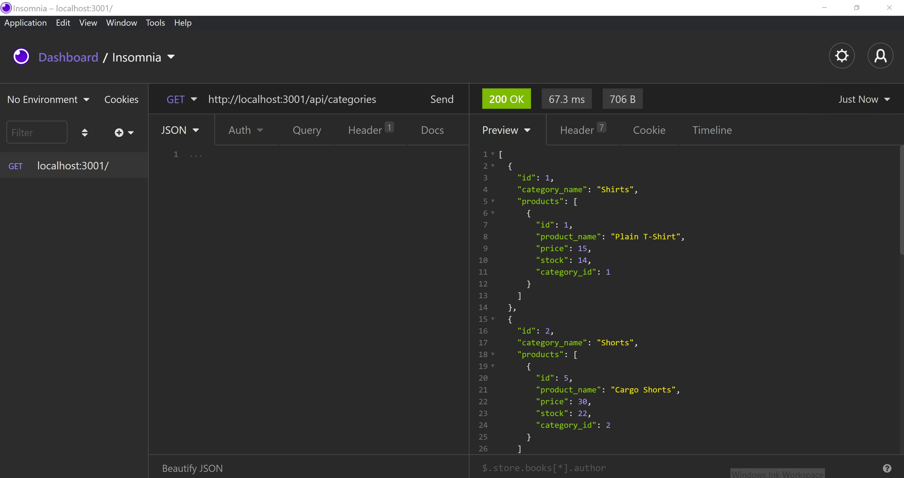

  

  [Walkthrough video link](https://drive.google.com/file/d/1mFBFGxaxsXyROaXzd-4Pm380TQ2d8vBj/view)

  [](https://opensource.org/licenses/MIT) 
  # e-commerce-back-end
  ## Description
  This application allows users to do CRUD operation to items stored in database using insomnia application. This app uses sequelize and it's association methods to connect to mysql database and it's models. 	

  ## Table of Contents
  * [Installation](#installation)

  * [Usage](#usage)

  * [License](#license)

  * [Test](#tests)

  * [Contribute](#contribute)

  * [Questions](#questions)

  ## Installation
  To install, clone this project in your directory. Make sure to install node.js and NPM along with all dependencies .
  Create database using schema.sql from db folder. Connect database by providing username, dbname and password in connection.js in config folder. 
  Then follow the following commands.
  ```bash
  install node.js
  npm install
  npm init
  npm run seed
  npm start
  ```  
  
  ## Usage
  Use Insomnia to make all the request at address localhost:3001/'whatyouwant'
  ## License
  This project is licensed under MIT license.

  [](https://opensource.org/licenses/MIT) 
  ## Tests
  No test available at the moment.
  ## Contribute
  No contributions at the moment.
  ## Questions
  For any questions, please contact 

  * lochan.sharad@gmail.com

  * [GitHub](https://github.com/best15)

